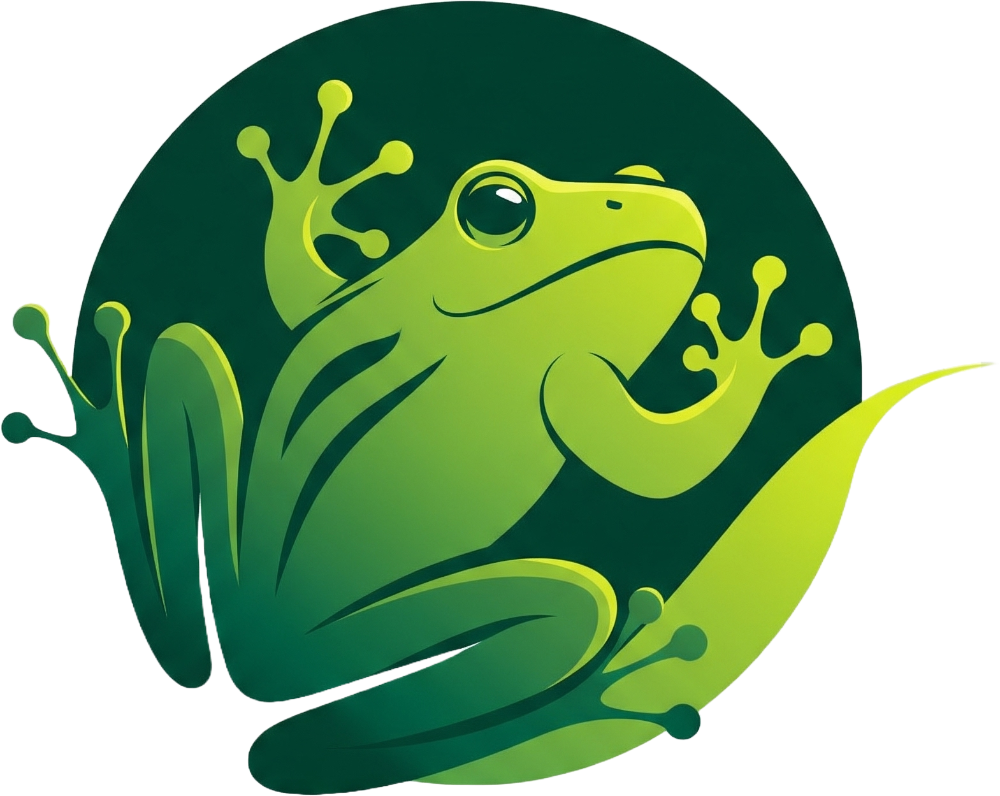

# Grog: The World's Most Ribbiting AI

  <a href="https://grog.chat"><strong>🐸 Try the Live Demo! 🐸</strong></a>

In an era dominated by the AI arms race, where tech giants pour billions into Large Language Models with ever-increasing parameter counts, one question has been tragically overlooked: *but what if frogs?*

Grog is the answer.

This is not just another LLM. This is an ALM (Amphibious Language Model). Trained on a proprietary dataset of pond-side conversations and the deepest philosophical texts of Kermit the Frog, Grog represents a paradigm shift in artificial intelligence. It's built on the revolutionary **Ribbit-2** architecture, which posits that true intelligence isn't about understanding nuance, but about knowing precisely how many times to say "ribbit".

---

### Features

*   **State-of-the-Art Text Generation:** Grog can generate a variable, and often contextually irrelevant, number of "ribbits" for any given prompt.
*   **Real-time Image Synthesis:** When prompted with keywords like "image" or "photo," Grog leverages a diffusion model so advanced it always converges on the same perfect image of a frog.
*   **Uncensored & Unbiased:** Grog has no opinions, only ribbits. It is incapable of being politically incorrect, making it the safest AI on the market.
*   **Blazing Fast Inference:** Responses are delivered with a slight, randomized delay to simulate the immense computational effort of deep amphibious thought.
*   **Dark Mode Native:** Because all serious AI research happens in the dark.
*   **Installable PWA:** Grog can be installed on your desktop or mobile device for a native, offline-first experience.

### How to Run

Running this next-generation AI requires a highly specialized setup.

1.  Ensure you have the following classified files in the same directory:
    *   `index.html`
    *   `site.webmanifest`
    *   `sw.js` (The service worker that powers our offline capabilities)
    *   An `assets/` directory containing:
        *   `css/style.css`
        *   `js/script.js`
        *   `img/frog.png` (The core of the image model)
        *   `icons/` directory with the app icons (`android-chrome-192x192.png`, etc.)
2.  Open `index.html` in a web browser.
3.  Prepare to have your mind blown.

### Roadmap / TODO

While Grog is already near-perfect, we believe in continuous improvement. Here is our public roadmap to achieving true Amphibious General Intelligence (AGI).

-   [ ] **Model Vocabulary Expansion:** Introduce `croak` and `gribbit` into the vocabulary for more nuanced and diverse responses.
-   [ ] **Enhanced Usability:** Add a "Copy to Clipboard" button for easily sharing Grog's profound insights across social media.
-   [ ] **Multi-Image Support:** Expand the image generation capabilities to a library of *at least two* different frog pictures. This is a significant engineering challenge.
-   [ ] **User Feedback Mechanism:** Implement a "Rate this Ribbit" feature. (Note: All ratings will be stored locally and then promptly ignored).
-   [ ] **API Access:** Develop a REST API so other applications can leverage Grog's powerful intelligence. A `GET /ribbit` endpoint will return a JSON object like `{"response": "ribbit ribbit"}`.
-   [ ] **Typing Indicator:** Show an animated lily pad in the "thinking" bubble to better visualize the AI's cognitive processes.

### License

This project is open-source and available under the MIT License. Feel free to fork, modify, and distribute it as you see fit. Just don't try to pass it off as a real LLM, unless you're trying to be funny.

---

*Disclaimer: Grog is parody and not a real AI. It does not connect to any external services. Please do not ask it for financial advice.*